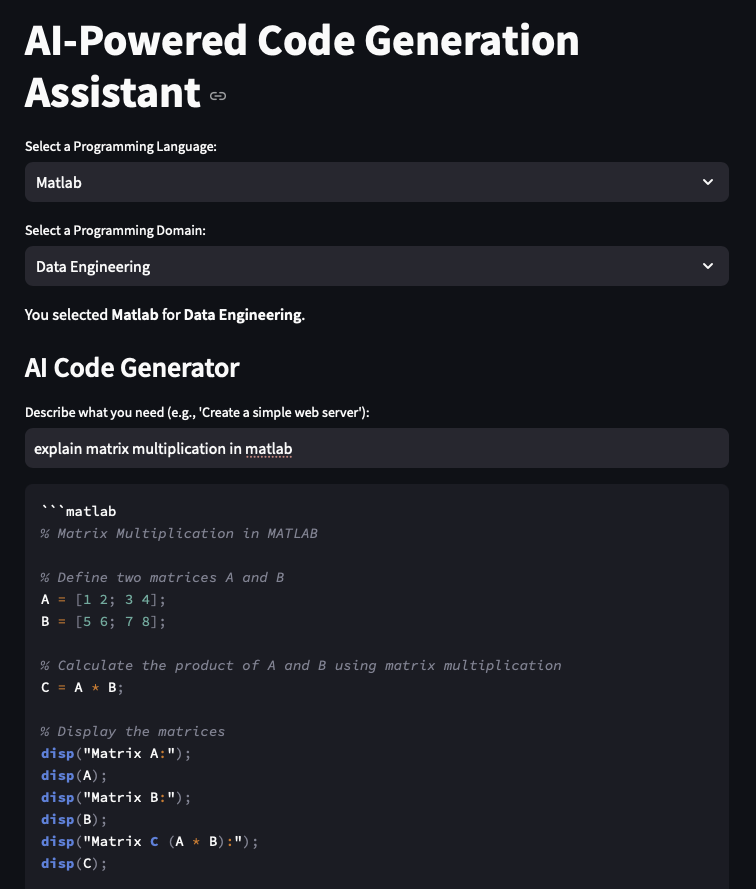
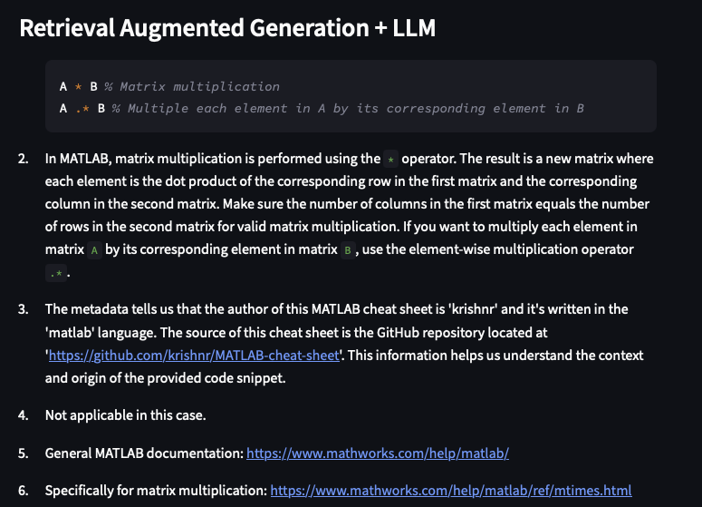
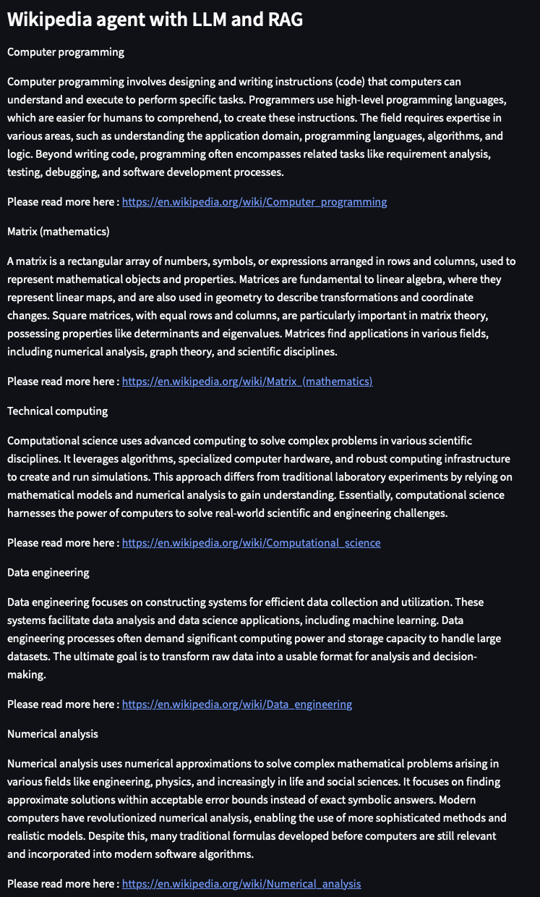
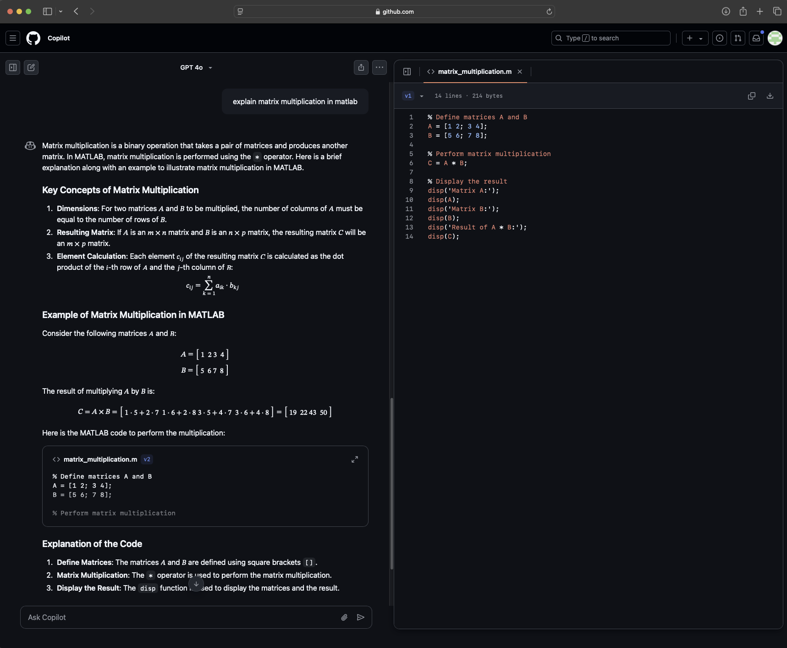
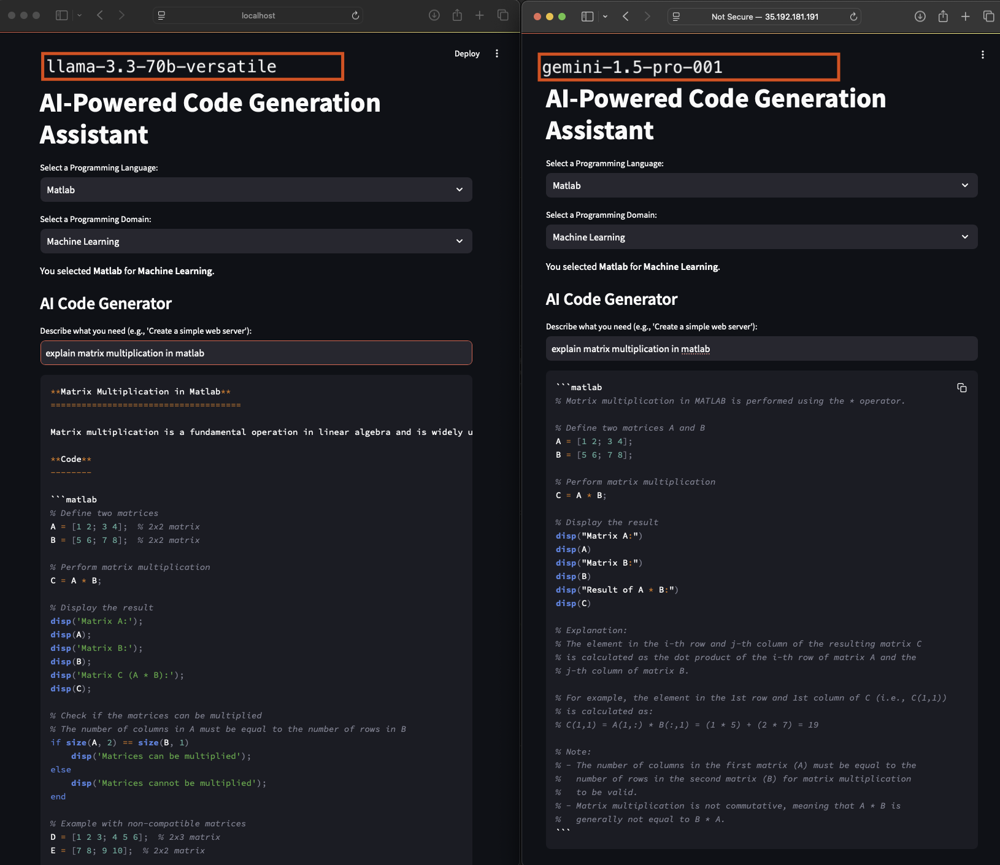
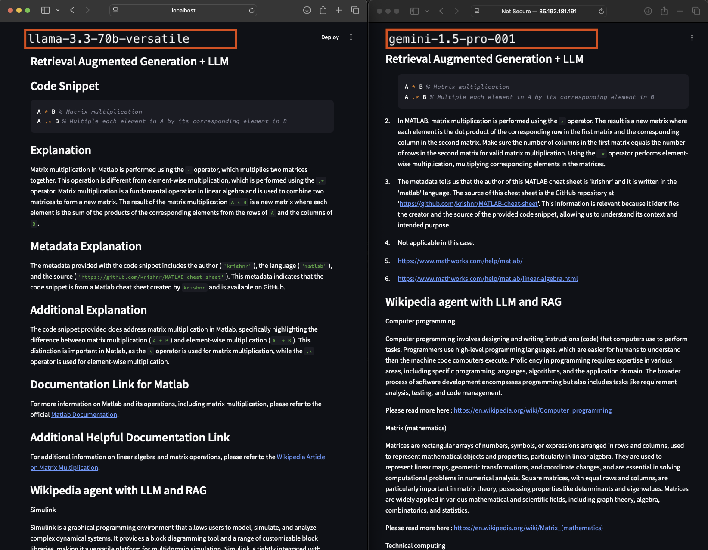
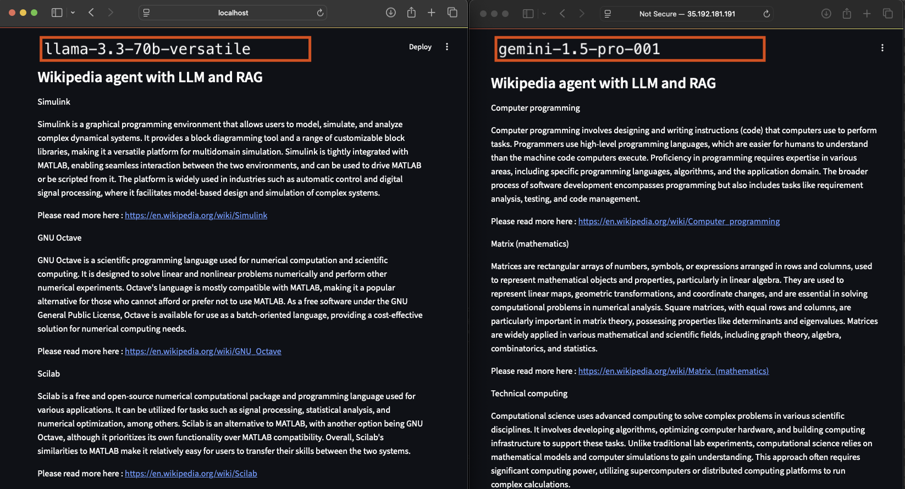
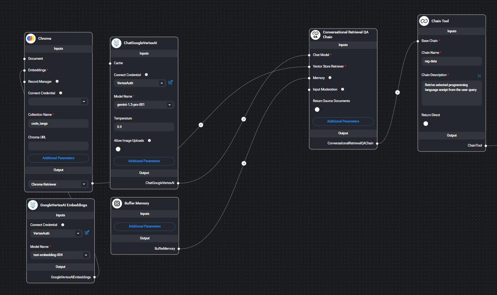
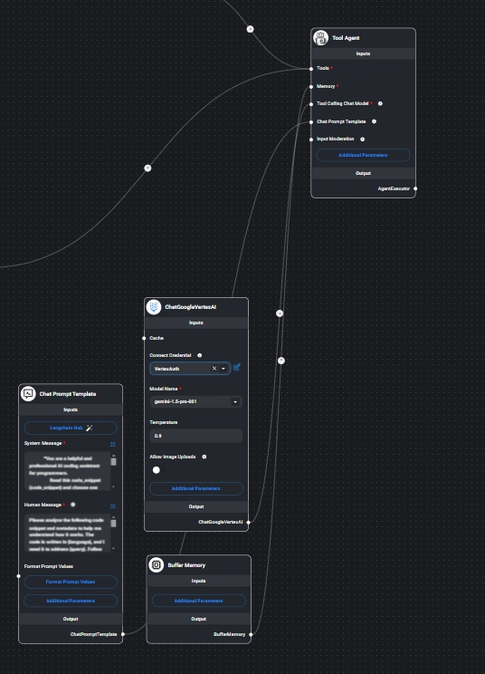

## 1. Comparison of Code asssistant vs Github CoPilot
Given the same query to Code Generation Assistant LLM application and GitHub Copilot, notable differences in their responses can be observed. Below, these differences are analyzed using screenshots and explanations.
_____________________________________________________________________________________________________________________
<< SCREENSHOT 1 >>

_____________________________________________________________________________________________________________________
Code Assistant utilizes the Gemini-1.5-Pro model to generate example code relevant to the given query. The output is structured to include clear and detailed explanations alongside the code, ensuring that users not only receive a working implementation but also understand how it functions. In this case, the request was to implement matrix multiplication using MATLAB.
_____________________________________________________________________________________________________________________
<< SCREENSHOT 2 >>

_____________________________________________________________________________________________________________________
Following the initial code generation, the assistant performs a similarity search in ChromaDB, a vector store containing various code snippets from different programming languages. These snippets are sourced from real-world implementations, providing users with alternative perspectives on solving the problem. The assistant also includes credentials and references for the original sources, allowing users to further explore the implementations. Additionally, it provides relevant documentation links that might be beneficial for deeper learning and verification.
_____________________________________________________________________________________________________________________
<< SCREENSHOT 3 >>

_____________________________________________________________________________________________________________________
To further enrich the learning experience, the assistant retrieves additional reading materials from sources such as Wikipedia. These materials help users develop a broader conceptual understanding of the topic beyond just the implementation. This ensures that users not only know how to write the code but also grasp the underlying principles that govern the operation.
_____________________________________________________________________________________________________________________

<< SCREENSHOT 4 >>

_____________________________________________________________________________________________________________________
In contrast, GitHub Copilot provides a more concise and streamlined response. Its approach includes:

Mathematical Explanation: Copilot introduces matrix multiplication by explaining the linear algebra principles that underlie the operation. This offers users some theoretical background before diving into the code.

Code Implementation: On the right-hand side, Copilot generates MATLAB code for matrix multiplication, ensuring that users have a practical solution to their query.

 Feature | Code Assistant LLM Application | GitHub Copilot |
|---------|-------------------------------|---------------|
| **Code Generation** | Provides structured, detailed code with comments and explanations | Generates code but with fewer explanations in comparison|
| **Mathematical Background** | Focuses on programming implementation rather than math or other background concepts | Explains background principles before providing code |
| **Similarity Search** | Fetches additional examples from ChromaDB with citations | No similarity search is provided |
| **Supplementary Reading Materials** | Includes external resources such as Wikipedia for more learning | Does not provide additional reading material |
| **Reference to Real Implementations** | Sources code snippets from real implementations | Generates code based on internal model |

Conclusion

Both Code Assistant LLM application and GitHub Copilot serve valuable roles depending on the user's needs:

For users who prioritize programming support and want detailed explanations, code variations, and access to external learning materials, our LLM application is the better choice.

For users who prefer a quick, to-the-point solution with some mathematical background, GitHub Copilot provides an efficient response.

Overall, both systems can significantly benefit users, and their effectiveness largely depends on whether the user is looking for in-depth learning or quick code generation.

_____________________________________________________________________________________________________________________

## 2. Comparison of Gemini-1.5-Pro and Llama-3.3-70B-Versatile in a Code Assistant Application

This section presents a comparison of the outputs generated by two large language models (LLMs) used in a code generation assistant application. The models being compared are:

- **Gemini-1.5-Pro**, hosted on Kubernetes  
- **Llama-3.3-70B-Versatile**, hosted locally

To ensure a fair comparison, the same query was used for both models, and their outputs were analyzed side by side. The left side of each image shows the response from Llama-3.3-70B-Versatile, while the right side displays the output from Gemini-1.5-Pro.
_____________________________________________________________________________________________________________________

_____________________________________________________________________________________________________________________
When it comes to the AI code generation, there is not much difference in quality and both seemed to produce very similarly structured implementation. Gemini version had a bit more comments explaining the details of the code while the Llama version had long lines of codes that focused later on different examples.
_____________________________________________________________________________________________________________________

_____________________________________________________________________________________________________________________
As for the Retrieval Augmentted Generation section, Llama had much more extensive explanation about the code snippet pulled from the ChromaDB vector store and its metadata. Similar to the original Gemini version, it provided additional Documentation links related to the the language and queries. Furthermore, even though the prompt for both versions were exactly the same, Llame decided to print the output for RAG explanation in slightly different format from Gemini version.
_____________________________________________________________________________________________________________________

_____________________________________________________________________________________________________________________

Lastly, comparison of the Wikipedia agent that is supported by the LLM models. Interestingly, the Llama version seemed to perform better in choosing more related Wikipedia pages to the queries and the language. In comparison, Gemini focuses more on general concepts about the mathematical background and scientific computing. This is considering that both used the prompt template. 

_____________________________________________________________________________________________________________________
Conclusion
While both models performed well across different tasks, their responses showed distinct characteristics:

- **Gemini-1.5-Pro** focused on clarity through additional comments and theoretical explanations.
- **Llama-3.3-70B-Versatile** Llama-3.3-70B-Versatile offered more extensive examples, detailed metadata explanations in RAG, and better Wikipedia page selection.

Overall, both models demonstrated strong capabilities in code generation and retrieval-augmented responses.
_____________________________________________________________________________________________________________________

# 3. Limitations and Asssumptions of the application

1. The RAG is quite limited and the data on the vector store is not large enough to cover many of the key concepts in various domains. When asked to retrieve ML concepts such as Convolutional Neural Networks, it won't be able to pull relavant information because of the limited data.
2. The vector store data is computationally expensive and takes a lot of time to tokenize and embed the documents. Initially the total collection of the data for this project was slightly more than 7gb to make sure that it stores enough knowledge but it was soon realized it would be not feasible. As such the data was reduced to 7 mbs.
3. Another limitation was that the vector store sizes are many times over the original data. The final vector store on 7 mb raw data was about 57 mb which is about 8 times the original. With much larger data, it can become very expensive and become bottleneck for large project when implementing the RAG.
4. When it comes to different LLMs that are implemented in the application, the assumption is that application will perform equally. But this may not be the case and the performance and capacity of this Code Assistant application is highly dependent on LLM accuracy and reasoning abilities.

# 4. FlowiseAI explanation
_____________________________________________________________________________________________________________________

1. The structure of flowise AI which is corresponding to the code:
Data Flow Architecture

User Input (user_query, selected_language, selected_domain)\
    │\
    ├── Code Generation Chain (Independent) → Generates Code → Displays Code\
    │\
    ├── RAG Chain (Uses Code Database Retrieval) → Analyzes Code → Displays Explanation\
    │\
    └── Wikipedia Chain (Retrieves Relevant Knowledge)\
          ├── Selects Relevant Wikipedia Articles → Extracts Summary → Displays Summary\
          └── Selects Wikipedia Articles Based on Programming Domain → Extracts Summary → Displays Summary\

it mainly contains three parts:
chroma db, main part, wiki agent

---------------------------------------------------------------------------------------------------------------------
2. the structure of Chroma DB
The code is stored as a vector store in Chorma DB, so using the Chorma DB as a tool,\
and connect the main part use chain tool. which perform the RAG work

---------------------------------------------------------------------------------------------------------------------
3. the structure of Wiki agent
the wiki agent also act as a  tool connect main part with tool chain.\
it wiki main part has  three tools,\
one tool is use wiki api from rapid api to get the content of wiki from user query\
second is generate four titles from language and domain\
third is generate four titles from only language.

---------------------------------------------------------------------------------------------------------------------
4. the main part 
it takes both wiki agent and chroma db as a tool and output based on them

_____________________________________________________________________________________________________________________

# 5. How to Run and environment settings
easiest way to use the application: http://35.192.181.191:8080/ then go to 6 (NO LONGER SUPPORTED)
_____________________________________________________________________________________________________________________
1. Before running please make sure to have the following packages installed in the environment:
   streamlit, vertexai, wikipedia, nltk, langchain_google_vertexai, langchain_core, wikipediaapi, chromadb, langchain-text-splitters, langchain, langchain-groq.
2.  Make sure to clone this repository and have the following files in one folder:
   - chromaDB_v2
   - main.py
   - rag.py
   - key.json
3. In the root directory install required library `pip install -r requirements.txt`.From the root directory run the following in your terminal: `streamlit run main.py` ro run the Code assistant locally.
4. Note that there is no need to run the `rag_testing.ipynb`. This notebook was setup to test certain features in the application.
5. Once it is run, the default browser will open the application.
6. Choose the language of your choce and also the domain.
7. Enter your query into the box (e.g. Explain for loop in Python). Once you hit enter, the application will run and return the related information to answer your query.

